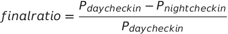

# **I - Discretization Testing:**

In this part, we will test the performance of the home localization method proposed by the paper. We will compute the
distance between localized homes, and the known homes of users. We will use a different dataet from the one used in the
paper, as there were not labeled check-ins.`

## *1 - True Home Location:*

We first start by defining the true homes of users. Therefore, we only keep users whose checkins with home label that
have a standard deviation of distance from the average home location less than a hundred meters. Then for the users
left, we compute the home location as the average of the locations of check-ins labeled as home.

## *2 - Discretization:*

The discretization method proposed by the paper has the following steps:

- We discretize the world into 25km-side squares.
- For each user, find the square with the most check-ins. Then, the home location is set as the average of the
  corresponding check-in locations in the most frequented square.

We use this method to find home locations of the users of the new dataset.

## *3 - Testing:*

We start by computing the distance between the true home location, and the home location provided by discretization.
Then, we visualize the distribution of distances.

We see that the distribution follows a power law that can be approximated by:

This indicates that there are users whose predicted home location is far by orders of magnitude from the original actual
home location.

Moreover, if we take a look at the CDF, we see that to achieve high accuracy, we need to tolerate large distances in the
order of thousands of kilometers.

In fact, the paper claims that their method reaches 85% accuracy through manual verification. Nevertheless, we see that
this does not apply to our dataset. Indeed, we need to tolerate distances up to 8'305km, which is larger than Europe.

In the following section, we will try to use Machine Learning methods to find the homes of users, and we will compare our
solution to the method proposed by the paper in terms of performance on the same dataset.

# **Header 2**

# **III - Checkin Patterns Between Friends:**

In this part, we seek to find some meeting patterns between friends. We say two friends have met if they checked in the
same place with at most one-hour difference.  
We will do three tasks in this part:

- Firstly, we will try to find the distribution of check-ins as a function of the distance from home and compare two
  cases: the case where users check-in with a friend, and the general case where users check in not taking into account
  friends.
- Secondly, we will try to find place check-in patterns: we will study the places where friends meet, and how likely
  some friends are to meet in a certain place depending on the whether it s a work day or weekend day. Then, we will
  study the distribution of check-ins in places depending on the time of the day (day or night).

## *1 - Checkin Patterns and Ditribution:*

We begin by getting the probability of distribution for two different datasets: dataset where we take into account all
the check-ins and dataset where we only study check-ins made with friends. In both cases, we only study users who
checked in at least once in their homes and assume their home is located at the average of check-ins labeled with
home `Home (private)`. We plot (loglog) the distribution for both datasets as a function from the distance from home and
try to describe the case where a user only moves to meet friends with a function of the type:

We now move to the visualisation

From the plot above, we can draw some conclusions:

- After fitting the curves, we get the approximated equtions for the probability distribution of the number of checkis
  as a function of the distance from home:

- We notice a change in the slope at a distance of approximately 20km distance from home. This behavior is similar to
  the one described in the paper 'Friendship and Mobility: User Movement In Location-Based Social Networks' (figure 1)
  .  
  However:
    - The distance from home where the shift happened is different (20km here vs 100km in the paper)
    - The slope are different than the ones described in the paper. In fact, while the slope is smaller for small
      distances in the paper (-1.9 < -0.9), the behaviour is different in our study (-0.44 > -1.3)
- Finally, we notice in the plots that whether a user visited a friend or not does not make much differences in the
  overall behavior of check-ins. We make the hypothesis that the behavior is the same and we test it. The null
  hypothesis is that friends don't have any influence on a user's movement.  
  After confirming that our data distribution is not normal (using a Kolmogorov Smirnov test), we use a Wilcoxon test to
  check whether friends have influence or not on the movement of a people. The result is interesting: having found a
  p-value of 0.0, we strongly reject the hypothesis and we conclude that even if the general behavior seems the same,
  the quantitative results show the contary.

## *2 - Place Check-in Patterns:*

- For the two remaining parts, we will only be working with the dataset containing only check-ins with friends. We make
  this choice because the goal of the paper is to predict mobility and see the influence of friends.
- To be able to find place patterns, we categorize our dataset:
    - places into different types: `Eat`, `Study`, `Drink`, `Culture`, `Home`, `Move`, `Consume`, `Work`, `Entertain`
      , `Sport`
    - day of the week into two types: `Working days`, `Week end day`
    - time of the day: `day` (between 5h and 17h) and `night` (between 17h and 5h)
- Then, we will study the probability that people meet in different places as a function of:
    - Time of the day
    - Day of the week

### i - Day of the Week Check-in Patterns

- After computing the probability for checking in a certain place as a function of the day type, we conclude that people
  are the most likely to be studying. This observation can be explained by the fact that students are the most likely to
  use sociaal media, so the most number of check-ins can be found among students.

- Then, to be able to draw further conclusions, we do some processing to our results:
    - Get probability/day:
        - Divide probabilities that happened in work day by 5
        - Divide probabilities that happened in week end day by 2
    - Get ratio of results found
    - The final equation we find for each place is:

- In the end:
    - If this difference is positive: people are more likely to check-in in the place in a working day
    - If this difference is negative: people are more likely to check-in in the place in a week end day
    - The absolute value gives us the magnitude of the absolute ratio

- After observing the figure, we conclude that people tend to meet their friends more in work or study places during the
  week. This can be explained by the fact that people usually have their coworkers and classmates as friends on social
  media. Studying or working is part of people's obligations and these are task are generally proceeded during the week
- However, when it comes to free time (week end for most of people), people choose to meet their friends in diverting
  places (every other category that doesn't involve working or studying). Specifically, people are the most likely to go
  out in weekend to have drinks or to entertainement places.
- Finally, people tend to spend their day working and studying, and then spend their evening and night in diverting
  places (eating, having drinks.

### ii - Period of the Day Check-in Patterns:

- Now we move to studying the times of the day friends are the most likely to meet.

- We first notice that:
    - The biggest probability of checking in with friends during day occurs during studying
    - The biggest probability of checking in with friends during night occurs during night.
- Then, we do a similar processing work than the one we did in the previous part: we compute the ratio of check-ins in
  day or at night.  
  We use the equation below to compute the ratios:

- We can see that friends are more likely to meet during the day to study or work. Moreover, they are more likely to
  meet at night to have night, even if the difference is small.
- We can also conlude that most check-ins happen to be during the day and that people tend less to check-in at night.
